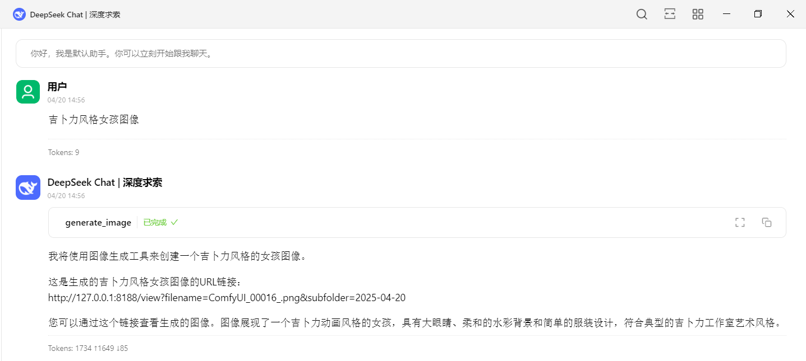
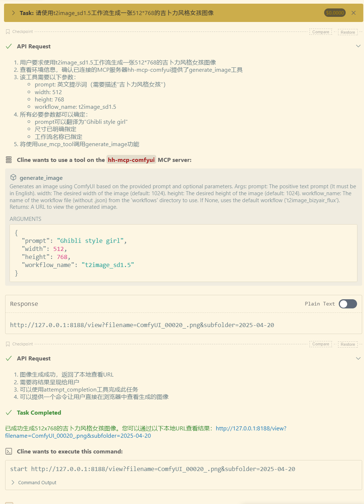
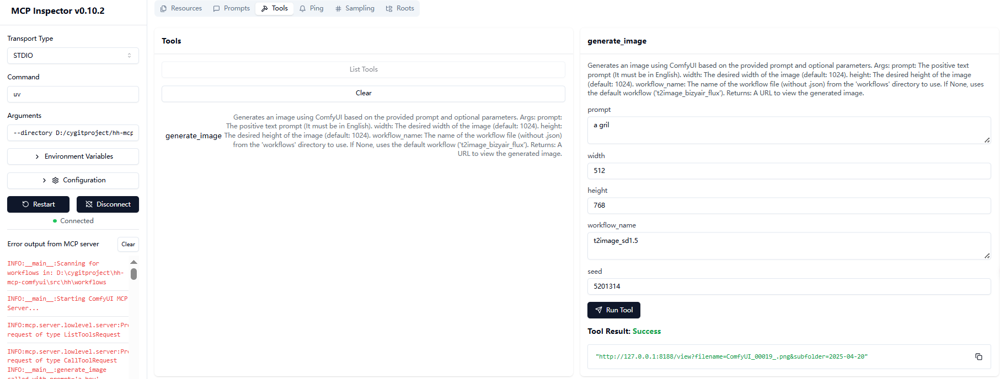

# ComfyUI MCP 服务


这是一个基于Model Context Protocol (MCP)的ComfyUI图像生成服务，通过API调用本地ComfyUI实例生成图片。

## 功能特性

- 通过MCP协议提供图像生成服务，实现自然语言生图自由
- 支持动态替换工作流中的提示词和尺寸等参数
- 自动加载workflows目录下的工作流文件作为资源
## 效果

- **Cherry Studio中使用效果**


- **Cline中使用效果**



## 安装依赖

**1. 确保已安装Python 3.13+**

**2. 使用uv管理Python环境：**
- 安装uv:
```bash
# On macOS and Linux.
$ curl -LsSf https://astral.sh/uv/install.sh | sh

# On Windows.
$ powershell -ExecutionPolicy ByPass -c "irm https://astral.sh/uv/install.ps1 | iex"

# 更新uv(非必要操作):
$ uv self update

```
- 初始化项目环境：
```bash
# Clone the repository.
$ git clone https://github.com/zjf2671/hh-mcp-comfyui.git

$ cd hh-mcp-comfyui

# Initialized venv
$ uv venv

# Activate the virtual environment.
$ .venv\Scripts\activate

# Install dependencies.
$ uv lock
Resolved 30 packages in 1ms

# sync dependencies.
$ uv sync
Resolved 30 packages in 2.54s
Audited 29 package in 0.02ms

```
- 样例工作流copy到指定工作流目录：
```bash
# 进入项目目录
$ cd hh-mcp-comfyui

# 创建工作流没有这个目录执行下面进行创建（这个目录位置不能动）
$ mkdir src\hh\workflows

#复制样例工作的工作流目录
$ cp .\example\workflows\* .\src\hh\workflows\

```

## 测试运行服务

```bash
$ uv --directory 你本地安装目录/hh-mcp-comfyui run hh-mcp-comfyui

INFO:__main__:Scanning for workflows in: D:\cygitproject\hh-mcp-comfyui\src\hh\workflows
INFO:__main__:Registered resource: workflow://i2image_bizyair_sdxl -> i2image_bizyair_sdxl.json
INFO:__main__:Registered resource: workflow://t2image_bizyair_flux -> t2image_bizyair_flux.json
INFO:__main__:Registered resource: workflow://t2image_sd1.5 -> t2image_sd1.5.json
INFO:__main__:Starting ComfyUI MCP Server...
```
**出现上面的信息表示服务启动成功**

## 使用方法

### 作为MCP服务使用

1. 必须确保本地ComfyUI实例正在运行(默认地址: http://127.0.0.1:8188)
[ComfyUI安装地址](https://github.com/comfyanonymous/ComfyUI.git)

2. Cherry Studio、Cline、Cursor等客户端的使用方式
```bash
{
  "mcpServers": {
    "hh-mcp-comfyui": {
      "command": "uv",
      "args": [
        "--directory",
        "项目绝对路径（例如：D:/hh-mcp-comfyui）",
        "run",
        "hh-mcp-comfyui"
      ]
    }
  }
}
```

## 测试

- 可以使用MCP Inspector测试服务端工具：
```bash
npx @modelcontextprotocol/inspector
```
把这个配置复制进MCP Inspector的配置中，然后点击连接：
- Transport Type：STDIO
- Command：uv 
- Arguments：--directory 你本地安装目录/hh-mcp-comfyui run hh-mcp-comfyui


## 扩展

### 添加新工作流

1. 将工作流JSON文件放入`src/hh/workflows`目录中
2. 重启服务自动加载新工作流

### 自定义参数

修改`server.py`中的`generate_image`工具定义来添加新参数

## 项目结构

```
.
├── .gitignore
├── .python-version
├── pyproject.toml
├── README.md
├── uv.lock
├── example/              # 示例工作流目录
│   └── workflows/
│       ├── i2image_bizyair_sdxl.json
│       ├── t2image_bizyair_flux.json
│       ├── i2image_cogview4.json
│       └── t2image_sd1.5.json
├── src/                  # 源代码目录
│   └── hh/
│       ├── comfyui_client.py    # ComfyUI客户端实现
│       ├── server.py            # MCP服务主文件
│       └── workflows/           # 工作流文件目录
```

## 使用注意事项（针对没有用过comfyui的特别注意）

- 默认工作流为`t2image_bizyair_flux`
- 图片尺寸默认为1024x1024
- 服务启动时会自动加载workflows目录下的所有JSON工作流文件
- 如果你使用的是本项目中的**样例工作流**需要在comfyui中下载个插件，详细操作请查看：[样例工作流插件安装教程](https://ziitefe2yxn.feishu.cn/wiki/PlSmwBbBWiA0iDkc07scb4EEnHc)
- 如果使用你本地的comfyui工作流的话，先要保证你的工作流能在comfyui正常运行，然后需要导出(API)的JSON格式，并放入workflows目录中


## 贡献

1. Fork项目
2. 创建特性分支 (`git checkout -b feature/AmazingFeature`)
3. 提交更改 (`git commit -m 'Add some AmazingFeature'`)
4. 推送到分支 (`git push origin feature/AmazingFeature`)
5. 打开Pull Request

---
## 如有问题可以到公众号中联系我：

*<center></center>*

<center><u>👆 扫码关注，发现更多好玩的！</u></center>

---
