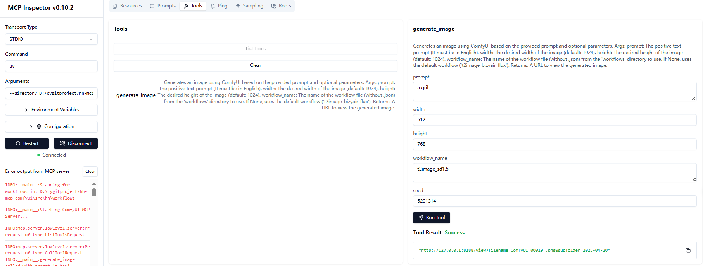

# ComfyUI MCP Service

[](README.EN.md)
[](../README.md)


This is a ComfyUI image generation service based on Model Context Protocol (MCP), which generates images by calling a local ComfyUI instance through API.

## Features

- Provides image generation service via MCP protocol, enabling natural language to image generation
- Supports dynamic replacement of parameters like prompts and dimensions in workflows
- Automatically loads workflow files from the workflows directory as resources

## Update History
- [2025-05-07] Added pip build method
- [2025-05-06] Changed project directory from src/hh to src/hh_mcp_comfyui, added uvx build method
- [2025-04-26] Added image-to-image and background removal sample workflows, and support for image-to-image tool
- [2025-04-20] Added text-to-image generation tool
 
## Results

- **Effect in Cherry Studio**


- **Effect in Cline**


## Installation

**1. Ensure Python 3.13+ is installed**

**2. Use uv to manage Python environment:**
- Install uv:
  ```bash
  # On macOS and Linux.
  $ curl -LsSf https://astral.sh/uv/install.sh | sh

  # On Windows.
  $ powershell -ExecutionPolicy ByPass -c "irm https://astral.sh/uv/install.ps1 | iex"

  # Update uv (optional):
  $ uv self update
  ```
- Initialize project environment:
  ```bash
  # Clone the repository.
  $ git clone https://github.com/zjf2671/hh-mcp-comfyui.git

  $ cd hh-mcp-comfyui

  # Initialize venv
  $ uv venv

  # Activate the virtual environment.
  $ .venv\Scripts\activate

  # Install dependencies.
  $ uv lock
  Resolved 30 packages in 1ms

  # Sync dependencies.
  $ uv sync
  Resolved 30 packages in 2.54s
  Audited 29 package in 0.02ms
  ```

## Test Run Service
- **uv method**

  ```bash
  $ uv --directory your_local_install_directory/hh-mcp-comfyui run hh-mcp-comfyui

  INFO:__main__:Scanning for workflows in: D:\cygitproject\hh-mcp-comfyui\src\hh_mcp_comfyui\workflows
  INFO:__main__:Registered resource: workflow://t2image_bizyair_flux -> t2image_bizyair_flux.json
  INFO:__main__:Starting ComfyUI MCP Server...
  ```
- **uvx method**
  ```bash
  $ uvx hh-mcp-comfyui

  INFO:hh_mcp_comfyui.server:Scanning for workflows in: C:\Users\tianw\AppData\Local\uv\cache\archive-v0\dp4MTo0f1qL0DdYF_BYCL\Lib\site-packages\hh_mcp_comfyui\workflows
  INFO:hh_mcp_comfyui.server:Starting ComfyUI MCP Server...
  ```
- **pip method**
  ```bash
  $ pip install hh_mcp_comfyui
  
  $ python -m hh_mcp_comfyui

  INFO:hh_mcp_comfyui.server:Scanning for workflows in: F:\Python\Python313\Lib\site-packages\hh_mcp_comfyui\workflows
  INFO:hh_mcp_comfyui.server:Starting ComfyUI MCP Server...
  ```
**The above information indicates successful service startup**

## Copy Sample Workflows to Specified Workflow Directory:
- **uv**
  ```bash
  # Enter project directory
  $ cd hh-mcp-comfyui

  # Create workflows directory if it doesn't exist (this directory location cannot be changed)
  $ mkdir src\hh_mcp_comfyui\workflows

  # Copy sample workflows
  $ cp .\example\workflows\* .\src\hh_mcp_comfyui\workflows\

  ```
  (**Important Note**: If using uvx or pip method below, find your local installation directory to add sample workflows, then restart your MCP service. You can locate your installation directory as shown below)
- **uvx**
  ```bash
  $ uvx hh-mcp-comfyui
  ```
  
- **pip**
  
   ```bash
  # First install dependencies
  $ pip install hh_mcp_comfyui
  $ python -m hh_mcp_comfyui
  ```

  

## Usage
> **Ensure local ComfyUI instance is running (default address: http://127.0.0.1:8188) [ComfyUI Installation](https://github.com/comfyanonymous/ComfyUI.git)**

### Usage in Cherry Studio, Cline, Cursor and other clients

- **uv MCP Service Configuration**
  ```bash
  {
    "mcpServers": {
      "hh-mcp-comfyui": {
        "command": "uv",
        "args": [
          "--directory",
          "absolute_project_path (e.g.: D:/hh-mcp-comfyui)",
          "run",
          "hh-mcp-comfyui"
        ]
      }
    }
  }
  ```
- **uvx MCP Service Configuration**
  ```bash
  {
    "mcpServers": {
      "hh-mcp-comfyui": {
        "command": "uvx",
        "args": [
          "hh-mcp-comfyui"
        ]
      }
    }
  }
  ```
- **pip MCP Service Configuration**

  First execute in command window: pip install hh_mcp_comfyui
  ```bash
  {
    "mcpServers": {
      "hh-mcp-comfyui": {
        "command": "python",
        "args": [
          "-m",
          "hh_mcp_comfyui"
        ]
      }
    }
  }
  ```

## Testing

> **Use MCP Inspector to test server tools**
  
- **uv method**
  ```bash
  $ npx @modelcontextprotocol/inspector uv --directory your_local_install_directory/hh-mcp-comfyui run hh-mcp-comfyui
  ```
- **uvx method**
  ```bash
  $ npx @modelcontextprotocol/inspector uvx hh-mcp-comfyui
  ``` 
- **pip method**
  ```bash
  $ pip install hh_mcp_comfyui
  $ npx @modelcontextprotocol/inspector python -m hh_mcp_comfyui
  ``` 

Then click connect as shown below to debug:


## Extensions

### Add New Workflows

1. Place workflow JSON files in `src/hh_mcp_comfyui/workflows` directory
  
    For uvx and pip startup methods, refer to **Copy Sample Workflows to Specified Workflow Directory** above

2. Restart service to automatically load new workflows

### Developer Custom Parameters

Modify the `generate_image` tool definition in `server.py` to add new parameters

## Project Structure

```
.
├── .gitignore
├── .python-version
├── pyproject.toml
├── README.md
├── uv.lock
├── example/              # Example workflows directory
│   └── workflows/
│       ├── i2image_bizyair_sdxl.json
│       ├── t2image_bizyair_flux.json
│       ├── i2image_cogview4.json
│       └── t2image_sd1.5.json
├── src/                  # Source code directory
│   └── hh_mcp_comfyui/
│       ├── comfyui_client.py    # ComfyUI client implementation
│       ├── server.py            # MCP service main file
│       └── workflows/           # Workflow files directory
```

## Usage Notes (Especially for those new to ComfyUI)

- Default workflow is `t2image_bizyair_flux`
- Default image size is 1024x1024
- Service automatically loads all JSON workflow files from workflows directory on startup
- If using **sample workflows** from this project, you need to download a plugin in ComfyUI. See details: [Sample Workflow Plugin Installation Tutorial](https://ziitefe2yxn.feishu.cn/wiki/PlSmwBbBWiA0iDkc07scb4EEnHc)
- If using your local ComfyUI workflows, first ensure they work normally in ComfyUI, then export them in API JSON format and place in src/workflows directory


## Contribution

1. Fork the project
2. Create feature branch (`git checkout -b feature/AmazingFeature`)
3. Commit changes (`git commit -m 'Add some AmazingFeature'`)
4. Push to branch (`git push origin feature/AmazingFeature`)
5. Open Pull Request

---
## For questions, contact me via WeChat Official Account:

*<center></center>*

<center><u>👆 Scan to follow and discover more fun stuff!</u></center>

---
